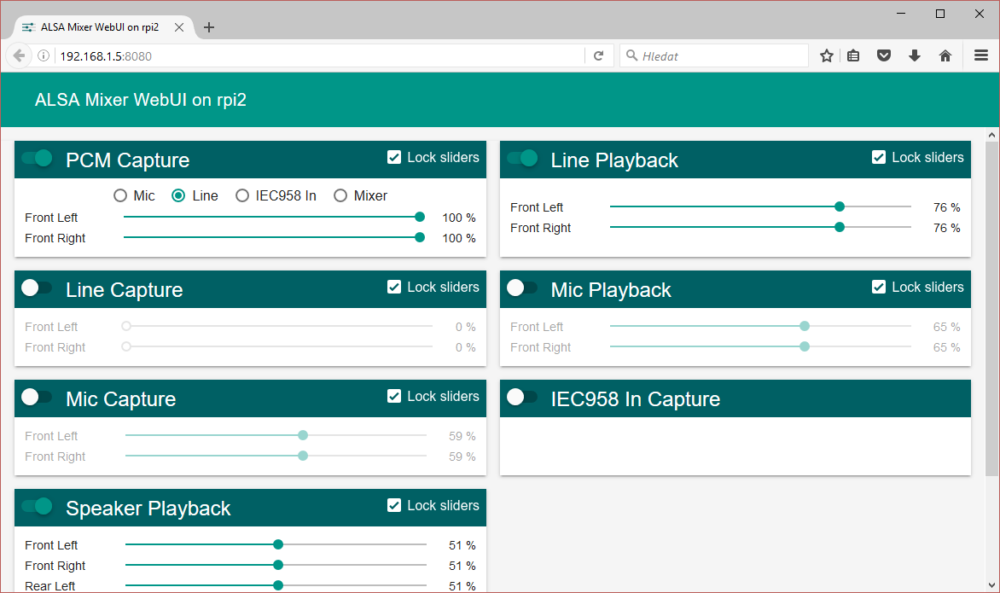

# ALSA Mixer WebUI

[](LICENSE)

Client-server application for easy configure of ALSA volume controls using network device (smartphone, tablet, PC, etc.).

[](screenshot.png)


## Server requirements

- python2


## Supported browsers

- Internet Explorer
- Edge
- Chrome
- Firefox
- Opera
- Chrome (Android)

## Getting Started

### Download / Clone

```bash
$ git clone https://github.com/JiriSko/amixer-webui.git
```

Alternatively you can [download](https://github.com/JiriSko/amixer-webui/archive/master.zip) this repository.

## Install

You can use init.d script `amixer-webui` (do not forget set correct path to files on line 19):

```bash
$ sudo cp amixer-webui /etc/init.d/amixer-webui
$ sudo update-rc.d amixer-webui defaults
$ sudo /etc/init.d/amixer-webui start
```

or simply run it e.g. from `rc.local` using:

```
/path/to/alsamixer-webui.py >/dev/null 2>&1 &
```

Default port is 8080, it can be easily changed by passing second CLI parameter.


## License

The application is released under [The MIT License](LICENSE). Software uses [Material Design Lite](https://github.com/google/material-design-lite) library which is licensed under an [Apache-2](https://github.com/google/material-design-lite/blob/master/LICENSE) license.